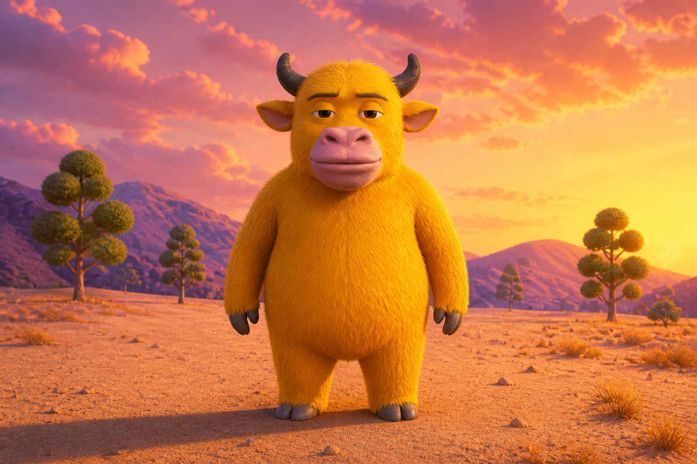

# Golden Horn Wanderer

一个针对 Pocket Live 动捕管线制作的原创牛形 VRM 0.x 角色：金黄色粗毛、短黑角、
侧耳、夸张粉色口鼻和困倦眼神。它只借鉴用户参考图中的宽泛 3D 卡通语言，不复制
具体电影角色、面部比例、场景或标志。



## 构建与启动

可见网格、程序纹理、morph 和 VRM metadata 都由本地脚本生成；仓库不提交生成的
`.vrm` 二进制：

```sh
bun run characters:build
bun run build:ui
bun run live:golden-horn
```

等价的显式插件选择：

```sh
bun run live -- \
  --character-plugin plugins/characters/golden-horn/plugin.json \
  --background-plugin plugins/backgrounds/golden-sunset/plugin.json
```

角色复用默认样例的标准 Humanoid 骨架与 inverse-bind 数据，以保持现有 VRMA、身体
IK 和手势跟踪兼容；可见网格与贴图完全重新生成。当前提供 `blink`、`a`、`joy` 和
`surprised` morph，眼球继续由 VRM 眼骨驱动。
